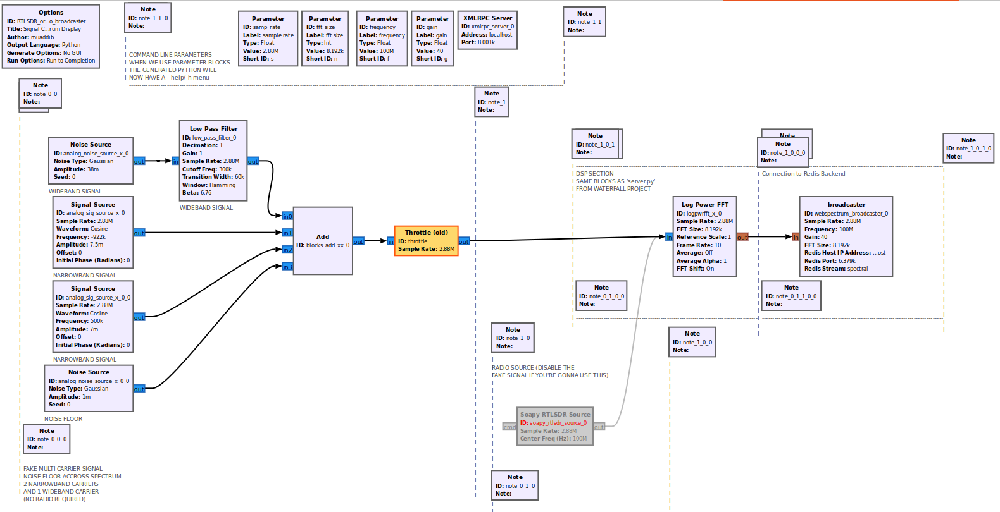
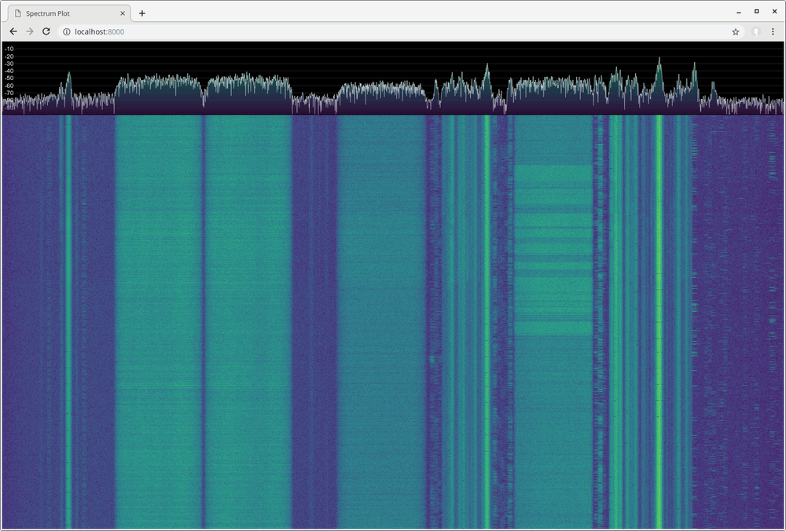

A Web-based spectrum display server for GNURadio
The web application code is the original 'waterfall' program by jledet. The receiver portion has been
reworked to accept a stream of vectors from GNURadio
Included Example Flowgraph:

Original Waterfall Project:
(https://github.com/jledet/waterfall)

ORIGINAL README Notes
********************************
HTML Canvas/WebSockets Waterfall
********************************

This is a small experiment to create a waterfall plot with HTML Canvas and WebSockets to stream live FFT data from an SDR:

``spectrum.js`` contains the main JavaScript source code for the plot, while ``colormap.js`` contains colormaps generated using ``make_colormap.py``.

``index.html``, ``style.css``, ``script.js`` contain an example page that receives FFT data on a WebSocket and plots it on the waterfall plot.

``server.py`` contains a example `Bottle <https://bottlepy.org/docs/dev/>`_ and `gevent-websocket <https://pypi.org/project/gevent-websocket/>`_ server that broadcasts FFT data to connected clients. The FFT data is generated using `GNU radio <https://www.gnuradio.org/>`_ using a USRP but it should be fairly easy to change it to a different SDR.

DESCRIPTION
The included flowgraph 'examples/RTLSDR_or_fake_signal_to_fft_to_zmq.grc' allows the user to 
run simulated spectrum into the server for testing, or enable the RTLSDR block to stream an RTLSDR
IQ stream into the server. To use with another SDR, simply replace the RTLSDR Source with your SDR's
block in GNURadio.

USAGE

run the zmq_server.py with the appropriate arguments. 
output of zmq_server.py -h
usage: zmq_server.py [-h] [-s SAMPLE_RATE] [-f FREQUENCY] [-n FFT_SIZE] [-r FRAME_RATE]
``
optional arguments:
  -h, --help            show this help message and exit
  -s SAMPLE_RATE, --sample-rate SAMPLE_RATE
  -f FREQUENCY, --frequency FREQUENCY
  -n FFT_SIZE, --fft-size FFT_SIZE
  -r FRAME_RATE, --frame-rate FRAME_RATE
the server is hardcoded to receive data on zmq port 5001 and display spectrum on 0.0.0.0 port 8200
``
Open the RTLSDR_or_fake_signal_to_fft_to_zmq.grc' in GNURadio Companion and run the flowgraph
-- or --
Disable the fake signals and enable the RTLSDR block, then run the flowgraph
(if you use the RTLSDR, make sure to disable the boxed out portion of signal sources and throttle)

Point your webbrowser to 0.0.0.0:8200
you will see the spectrum display

CREDITS
All credit for the web design goes to jladet, thanks for making a simple but elegant web interface
for displaying spectrum.

